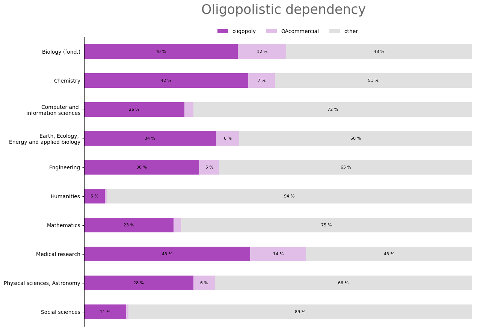

# Différences disciplinaires en contexte de Science ouverte. Etude avec les publications de l'archive ouverte HAL

Étude réalisée en 2022 avec Joachim Schöpfel, à partir des publications présentes dans HAL, visant à éclairer les différences entre disciplines scientifiques. Les discplines sont analysées selon les moyens de publication (type et langue), la porosité avec l'oligopole de l'édition scientifique et l'acculturation à l'archive ouverte HAL. Les résultats montrent deux groupes de trois disciplines s’inscrivant en contraste. Les sciences humaines, sociales et les mathématiques possèdent une forte diversité typologique, une forte autonomie oligopolistique et une faible visibilité dans WoS/Scopus. À l’inverse, la biologie, la chimie et la médecine possèdent une faible diversité typologique, une forte dépendance à l’oligopole et une très bonne visibilité dans WoS/Scopus.

 
 

* Article

Larrieu, M., & Schöpfel, J. (2022). Différences disciplinaires en contexte de Science ouverte. Étude avec les publications de l’archive ouverte HAL. In Document Numérique et Société: Communication scientifique et science ouverte: opportunités, tensions et paradoxes. https://hal.archives-ouvertes.fr/hal-03760316/

 
 

* Présentation 

[speakerdeck.com/mlarrieu/differences-disciplinaires-en-contexte-de-science-ouverte](https://speakerdeck.com/mlarrieu/differences-disciplinaires-en-contexte-de-science-ouverte), 2022-06-23, [8e Conférence du Document numérique et Société](https://docsoc2022.sciencesconf.org/), Liège, Belgique.

<!--
"""
memo variance, ecart type & surtout coefficient de variation
https://fr.wikipedia.org/wiki/Indicateur_de_dispersion#%C3%89cart_moyen
https://fr.khanacademy.org/math/be-4eme-secondaire2/x213a6fc6f6c9e122:statistiques-1/x213a6fc6f6c9e122:variance-et-ecart-type/a/calculating-standard-deviation-step-by-step
https://fr.khanacademy.org/math/be-4eme-secondaire2/x213a6fc6f6c9e122:statistiques-1/x213a6fc6f6c9e122:variance-et-ecart-type/a/population-and-sample-standard-deviation-review
https://fr.khanacademy.org/math/be-4eme-secondaire2/x213a6fc6f6c9e122:statistiques-1/x213a6fc6f6c9e122:variance-et-ecart-type/v/review-and-intuition-why-we-divide-by-n-1-for-the-unbiased-sample-variance
https://fr.wikipedia.org/wiki/Coefficient_de_variation

"""
-->
